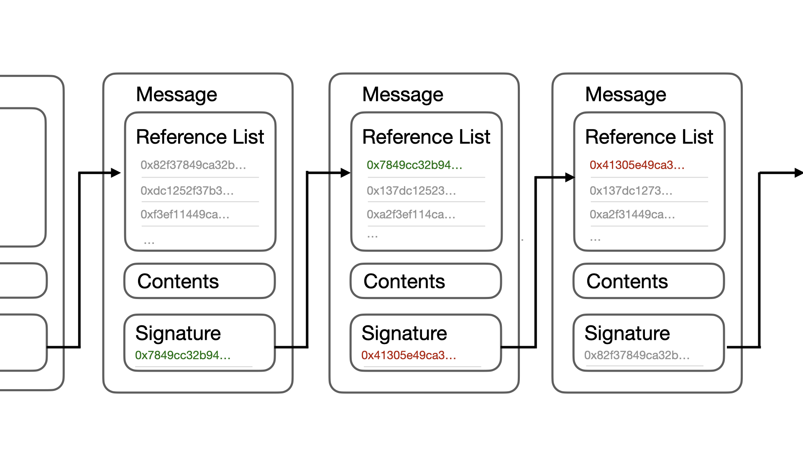

# PDU协议：点对点的社交网络服务
PDU Protocol: A Peer-to-Peer Social Netwrok Service
* email: liupeng@pdu.pub

**摘要：** 

一个完全点对点的社交网络系统应允许参与者自由发布信息并有效获取信息，且在使用过程中无需依赖任何第三方服务的帮助。然而，如果此系统没有采用如手机号等中心化的验证手段，使得可以零成本批量创建新账户，则会由于无法避免Sybil攻击（女巫攻击），导致系统的奖惩机制失效，正常内容被垃圾信息淹没，系统无法使用。本文提出了一种在不依赖任何第三方用户认证服务情况下构建点对点社交网络的方案。通过由相同私钥签名的消息形成全序列来建立可信的发布者身份。通过转发、评论、点赞等互动消息建立发布者之间的关联。基于上述关联关系，参与者可以按照自定义规则建立可见发布者身份集合，并在此相对固定的范围内，通过基于身份的奖惩机制实现信息的有效筛选。

## 简介

当今网络上的信息传播和交互主要依赖Facebook、Twitter/X、WeChat等中心化平台，这些平台的存在使得用户可以方便地发布信息，建立联系。平台使用各种算法来检测和过滤垃圾信息，确保用户体验。然而中心化社交服务的问题也逐渐凸显。第三方服务有可能滥用用户信息或泄露用户隐私数据。可能会利用其强大的用户基础来锁定用户，维护其垄断地位。此外，中心化服务还容易受到政府的监管和封锁，因为它们是目标清晰的可控实体。

尽管存在以上问题，但大多数用户仍然不得不继续使用原有平台。虽然更换平台不会导致数据丢失，但会失去在该平台上积累的用户关系，从而降低自身的影响力[^1]。这个原因使得用户很大程度上被平台锁定。

去中心化的社交平台近年来发展迅速，试图解决中心化平台带来的诸多问题，如Mastodon。Mastodon采用的联邦架构[^2]摒弃了单一中心，由多个可相互通信的服务器组成，使用户关系数据得以自行保存。然而，用户注册过程和内容管理仍依赖各服务器管理员。这种治理结构可视为多个独立小型中心化平台的集合，仍无法根本避免中心化平台中遇到的问题。

基于区块链的社交平台（如Steemit[^3][^4]和Minds[^5]）采用了一定数量的代币作为创建或激活账户的成本，同时利用代币激励用户的社交行为。尽管这种方法增加了创建账户的成本，但与中心化平台基于身份认证的方式不同。这种方式无法有效避免虚假账户的泛滥，并对经济能力较弱的用户产生不公平限制，从而降低了用户群体的多样性和包容性。

一些社交软件在积累用户的初期往往采用邀请制的方式来控制新用户的可信度，这种方法有效地防止了恶意注册和虚假账户的泛滥。然而，这种方式也会阻碍更广泛用户群体的参与。对于不认识现有用户的人来说，加入平台变得极为困难。此外，早期用户对社区文化和规则具有较大的影响力，这可能导致社区文化的单一性，难以吸引多元化的用户群体。

本文提出了一种全新的点对点社交网络系统，该系统不依赖任何第三方服务。任何具有相同私钥签名且具有全序关系的消息序列都被系统认定为合法的发布者身份，从而保证信息的不可篡改性，并能够更加公正地评判发布者身份。通过消息之间的互动，发布者身份之间能够形成公开的关联关系，我们将其视为用户之间的信任关系。任何使用者都可以根据这种关联关系，按自定义规则维护可见的发布者身份集合，并在此范围内以发布者的身份为标识，对信息进行有效过滤。

## 消息

消息被定义为系统中的基本数据结构，并且是点对点网络中传递的唯一信息类型。系统中的其他数据类型，如发布者身份等，都是基于这种公开数据由各个节点中自行生成。

如图1所示，每条消息由三个部分组成：消息内容、引用列表及签名。消息内容是消息的主体，分为内容信息和互动方式两部分，前者是文字图片等多媒体内容，后者包括发布、回复、引用、点赞等常见社交网络互动形式。引用列表可包含多条消息的签名，以表示当前消息与被引用消息的时序关系。当消息内容涉及回复或引用等互动类型时，相关消息的签名也应包含在引用列表中。为提供更精确的时序验证，还建议在引用列表中至少包含一条最新消息的签名。最终，将消息内容和引用列表合并计算出哈希值，并使用当前发布者的私钥对哈希值进行签名，以确认发布者身份并保证数据完整性。

尽管每条消息都有明确的内容，但我们往往无法仅凭单独的消息判断其是否为垃圾信息。例如，看到“推荐品尝M大街上的A餐馆”或“劝各位远离N大街上的B餐馆”这样的信息时，单独来看没有问题。然而，如果在短时间内出现数千次雷同的信息，就会被认为是垃圾信息及恶意操纵行为。在中心化平台中，用户的所有行为都会被平台记录，即便用户在事后将其删除，不良内容依然平台算法所捕捉，并对发布内容的账户进行限制或封禁，以确保用户的恶意行为会受到惩罚，正常信息不被淹没。

因此，我们需要一种方法，能够在必要时访问账户发布的所有信息，并确保其发布内容未被篡改。这有助于对发布者进行评估，以确定其发布的内容是否正常，并判断是否需要屏蔽该发布者以减少垃圾内容的出现。此外，还需要一种有效的发布者筛选机制，以确保不良发布者无法通过简单更换私钥的方式，在被惩罚后继续重复恶意行为。

## 发布者

为了对账户进行准确判断，我们需要确保账户发布的内容未被篡改，并能在发布者删除已发布消息时进行检测。在点对点分布式系统中实现这一特性，我们要求每个账户发布的内容形成类似区块链的链表结构[^6]。规定每条消息的引用列表中，第一条引用必须是同一私钥签发的上一条信息的签名，如图2。如果当前信息是此私钥所签名的第一条信息，则引用列表中的第一个值为0，以标示起点。

在区块链系统中，主链出现分叉的情况是由于矿工之间的算力竞争而非恶意行为，因此系统不会因分叉惩罚矿工，而是通过共识机制让全系统达成一致。在本系统中，由于签名无法伪造，一旦某发布者的消息链表中出现分叉，则被视为该发布者故意修改历史数据，属于主观恶意行为。除首条消息外，如果引用列表中的第一个签名指向的是其他私钥签名的消息，也被视为主观恶意行为。以上两种情况，对于发布者都应当予以惩罚。

如果发现引用列表中的首条消息还未被接收到，则应暂时保存该消息，不采信该条消息也不惩罚信息发布者。信息发布者有责任保存有自己签名的完整消息链表，以备在网络中某条消息丢失时向外部提供查验。

另一种情况是，发布者可能会隐藏分叉的消息链表，待到一个分叉中已经有多条消息被接收，再将另一个分叉的消息发布到系统中。在这种情况下，系统中已接受的消息将被视为既定事实。对发布者的惩罚通常是在发现冲突后丢弃冲突部分中后接收到的消息，并屏蔽该发布者。这样的惩罚方式将使得分叉攻击失去意义。

## 可见身份集合

基于签名消息构成的消息链表，使得任何发布者若试图篡改已发布的内容，都会被他人轻易察觉。因此，依赖这种数据形式，可以较为公正地对信息发布者进行评判。然而，如果身份被屏蔽后，恶意发布者可以零成本地更换签名私钥继续发布消息，这将导致惩罚机制失效。

传统的中心化平台在创建用户时，通常需要通过手机号等验证方式，将用户的现实身份作为创建虚拟身份的成本。在一些去中心化身份系统的项目中，如Sovrin[^7]等，也采用了类似的方式。这种做法相对合理，但必须借助可信任的第三方完成验证的部分。一些基于区块链的社交系统[^4]通过收取一定数量的代币作为创建账户的成本。然而，由于每个使用者的财富状况不同，很难找到一个既能吸引用户参与又能抑制垃圾账户创建的公平价格。

相关研究表明[^8-^10]，通过分析用户之间的互动行为，可以有效地计算出用户之间的信任关系。这种基于互动的信任评估方法在社交系统中表现出较高的精度，有助于识别并排除虚假账户，从而有效防止女巫攻击。在点对点的分布式系统中，所有信息都是基于公开消息的。这些消息内容已经包含了发布者之间的评论、点赞等互动行为。从任何一个发布者身份出发，我们都可以依据不同的信任关系阈值，将于其互动的发布者身份构建成多个不同程度的信任发布者集合。又因为用户之间的信任关系具有传递性[^11]，即如果一个用户被其他用户认为是可信的，那么与该用户有信任关系的第三方也将被认为是可信的。所以可以针对结果集合中的部分或全部身份，再次寻找与他们有互动关系的发布者身份进行计算，用这种方式逐步扩大可见用户集合中身份的数量。

需要注意的是，可见身份集合并不等同于传统中心化平台中的关注用户，而更类似于一个由使用者自己划定范围的平台用户集合。只有存在于这个范围内的身份所发布的信息才可能被使用者看到。这个可见用户集合既可以由使用者直接扩展，也可以按照定义的算法自动扩展或缩减。例如，集合中的用户如果主动与其他用户发生互动，则将被动方的身份加入到可见身份集合。再例如，当判定某个身份为垃圾信息发布者后，可以将引入该身份到可见身份集合的那个身份同时屏蔽。

在制定可见身份集合时，使用者如果自己有一个或多个发布者身份，虽然在扩充可见集合范围时通常会从这些身份开始，但这些身份在扩展过程中与其他身份并无本质区别。发布者身份与可见用户集合不存在任何绑定关系。

可见用户集合可以被视为一种自定义规则，根据这种规则，使用者根据公开的信息逐步计算出自己的可见用户范围。但在点对点的分布式系统中，系统不保证使用者可以获得全量信息，因此即便使用相同的算法，最终得到的可见身份集合也可能存在差异。

由于可见用户集合的存在，恶意的发布者虽然能够零成本更换私钥以另一个身份再次发布信息，但新的发布者身份不会轻易被其他用户接受，从而减小了垃圾信息的传播范围，避免了女巫攻击的影响。即便一个身份没有发布任何垃圾信息，但如果总是与被惩罚的发布者发生互动，也有可能因此被使用者移除出可见用户集合。

## 网络

去中心化网络由众多节点组成，每个节点生成一个相对固定的哈希值用于标识。节点根据其自定义的可见身份集合对收到的消息进行过滤。信息发布者与节点地址并不存在绑定关系，也不受可见身份集合的限制。发布者可以与任何消息产生新的互动消息，无论这些消息来自哪个节点或发布者。新消息是否被节点接受，只取决于签发消息的发布者是否在节点的可见身份集合内，而与原始的消息无关。

当一个身份只被网络中少量节点接受时，由于点对点的消息传递方式，即使许多接受该身份的节点也可能由于其他节点的过滤，无法收到新的消息。这种情况下，信息的传播范围会受到一定限制，消息的影响力可能较小。然而，通过评论、转发、引用、点赞等互动消息，可以间接地扩大消息的传播范围。高质量的消息往往能够通过这些互动形式，逐渐扩展其影响力和传播范围，使其发布者被更多的节点接受。

这种传播机制有助于实现信息传播的平衡和优化。尽管某些消息在初期的传播范围有限，但通过网络中的多种互动形式，高质量的内容能够突破初始的限制，扩大其覆盖面，最终在更广泛的节点间传播。

## 激励

在社交网络中，对于信息发布者而言，其自身利益的衡量标准在于其信息的传播程度。可以认为，发布者的唯一目的就是最大化信息的传播。因此，这个点对点的分布式网络对发布者的激励表现在帮助其扩大信息传播，而惩罚措施则是减少其信息传播。需要注意的是，与区块链所代表的去中心化系统不同，社交网络中并不存在系统级的统一共识，也就不存在系统对一个发布者身份的激励和惩罚。激励措施都是通过所有信息接受者表现的统计结果。

当一个发布者持续产生优质内容时，其内容更有可能受到其他发布者的互动。通过这些互动消息，当前发布者的内容有更大的概率被那些尚未将当前发布者身份列入可见身份集合的节点所接受。随着接受其身份的节点增多，其消息广播后，直接能够收到的节点也会增加。通过这种方式，当前发布者未来发布的内容会获得越来越大的传播。

相反，如果一个发布者持续发布垃圾内容或者持续与发布垃圾内容的消息进行互动，其他发布者与其互动的意愿会越来越少。一些已经接受当前发布者身份的节点也可能因此将这个地址从可见用户集合中剔除。因此，发布者的行为和内容质量直接影响其信息的传播范围和影响力。这里所指的垃圾信息并非特指包含色情、暴力、煽动仇恨的信息，还包括大量无意义、重复的信息。

总之，社交网络的激励机制通过发布者行为和内容质量的反馈，形成信息传播的动态平衡。优质内容发布者通过扩大其信息传播和影响力，最终能够通过与商业品牌互动等方式将影响力进行变现。这一过程类似于中心化平台中的广告系统，促使发布者不断优化其内容质量，以获得更广泛的传播和更大的经济收益。

## 区块链

在当前系统中，可以直接实现基于区块链的加密货币。将区块链中的一个区块包装成消息形式，由矿工作为信息发布者向外广播。

不同于传统区块链，社交系统中的发布者身份已经具备一定的意义。因此，可以选择更高效的共识机制，而不必单纯依赖算力。系统可以利用发布者身份来替代质押，限制矿工或验证者的范围，而非通过成功出块来扩大发布者的被接受程度，以避免扭曲当前系统的激励原则。权益证明（PoS）、委托权益证明（DPoS）、权威证明（PoA）以及雪崩（Avalanche）等共识机制都是相对合适的选择。

加密货币的实现也可以被视为由多个发布者组成一个更高层级的发布者。区块链由这些发布者共同参与，构成更高层次的全序消息队列。在系统内实现的区块链可以通过引用列表中的特定位置来标识区块消息的全序。

## 隐私

在传统的中心化社交网络中，通过给用户设置不同的访问权限来达到一定程度的隐私保护。然而，在去中心化的社交网络中，用户之间需要根据公开的消息定义用户身份，并要求所有公开的消息必须完整且有全序。如果用户选择将消息加密后再广播出去，对于不能解密的其他用户来说，这些消息无疑是无意义的垃圾信息，也无法与之互动，从而影响到发布者身份的接受程度。因此，在当前系统中，激励机制会鼓励所有发布者都只发布公开透明的信息。

如果需要类似传统社交网络中的一对一或一对多的有权限限制的通信，可以利用基于当前网络中的发布者身份，通过对方的公钥加密点对点的交流内容来保护隐私。但需要注意的是，这种保护隐私的消息交流方式并不属于当前点对点社交系统。应避免使用系统中的消息格式，以免被错误惩罚。

尽管系统中的信息都是公开的，但发布者可以选择保持公钥的匿名。在这种情况下，公众虽然可以看到公开发布的消息内容，但无法将网络中的发布者身份与现实世界中的身份关联。这种阻断信息流的方式也可以用来保护隐私。

##  第三方服务

作为点对点的社交网络系统，我们欢迎第三方服务的存在，但并不依赖于任何第三方服务。第三方的服务可以基于系统中的公开消息，为使用者提供更加高效，便利的服务，也能够提供更丰富的与系统之外交互的途径。

| 服务      | 说明
|----------|----------------------
|信息检索   |基于公开的消息，具备尽可能大的可见用户范围，校验信息完整性，不存在冲突，对外提供消息检索接口。
|消息传递   |基于发布者身份，对外提供用户间点对点的加密消息传递服务。
|数据统计   |基于公开的消息和发布者身份，统计消息的互动情况，计算信息传播程度。
|广告平台   |基于发布者身份及信息传播度，连接发布者与广告主。
|其他服务   |因为发布者身份具有成本，因而可以推行的服务，如投票等。

## 结论

我们提出了一个无需依赖任何第三方服务即可实现的点对点社交网络系统。首先，定义了统一的消息格式，通过具有相同私钥签名且具有全序关系的消息，构成信息发布者身份，并以此来保证消息不可被篡改。然而，如果使用者可以零成本地创建新身份，那么基于身份的惩罚措施将无法有效地避免女巫攻击。为了解决这个问题，我们基于消息间的互动关系，允许信息获取者自定义算法规则，生成可见发布者身份集合。与传统的中心化社交网络不同，这个系统中过滤后的消息因使用者而异，并不具有系统一致性。

发布者可见性来自于消息之间的互动。优质的信息发布者通过发布高质量内容，吸引其他发布者与其互动，并通过互动消息的扩散，进一步扩大其身份的被接受范围。这种激励机制鼓励发布者不断创造有价值的内容。

虽然系统中的所有消息都是公开的，但用户仍然可以基于已建立的身份信息，通过系统外的其他途径传递加密数据。同时，可以通过信息阻断，分割网络中的身份和现实中的身份，从而进一步保护隐私。

基于该系统，可以轻松移植现有的主流区块链共识机制。由于系统中具备身份创建成本，还可以对一些需要质押限制的共识机制进行优化，有助于提升加密货币的安全性和稳定性，提升用户体验。

## 参考文献
[^1]: Hatamleh, I.H.M., Safori, A.O., Habes, M., Tahat, O., Ahmad, A.K., Abdallah, R.A.-Q., and Aissani, R., "Trust in Social Media: Enhancing Social Relationships," Social Sciences, vol. 12, no. 7, p. 416, 2023. doi: 10.3390/socsci12070416. Available: https://www.mdpi.com/2076-0760/12/7/416
[^2]: L. La Cava, S. Greco, and A. Tagarelli, "Understanding the growth of the Fediverse through the lens of Mastodon," Applied Network Science, 2021. [Online]. Available: https://arxiv.org/pdf/2106.15473
[^3]: Steemit, "Steem Platform Whitepaper 2.0," GitHub Repository, 2024. Available: https://github.com/steemit/whitepaper
[^4]: M. Thelwall, "Can social news websites pay for content and curation? The SteemIt cryptocurrency model," Journal of Information Science, vol. 44, no. 6, pp. 736-751, 2018. doi: 10.1177/0165551517748290. Available: https://sci-hub.ru/10.1177/0165551517748290
[^5]: B. Ottman and J. Doe, "The Censorship Effect," Minds, 2019. Available: https://cdn-assets.minds.com/The_Censorship_Effect.pdf
[^6]: S. Nakamoto, "Bitcoin: A Peer-to-Peer Electronic Cash System," 2008. Available: https://bitcoin.org/bitcoin.pdf
[^7]: D. Reed and D. Hardman, "How DIDs, Keys, Credentials, and Agents Work Together in Sovrin," Sovrin Foundation, 2018. Available: https://sovrin.org/wp-content/uploads/2019/01/How-DIDs-Keys-Credentials-and-Agents-Work-Together-in-Sovrin-131118.pdf
[^8]: G. Jethava and U. P. Rao, "An Interaction-Based and Graph-Based Hybrid Approach to Evaluate Trust in Online Social Networks (OSNs)," Arabian Journal for Science and Engineering, vol. 47, no. 8, pp. 9615–9628, 2022. doi: 10.1007/s13369-021-06332-w. Available: https://link.springer.com/article/10.1007/s13369-021-06332-w
[^9]: W. Lin, Z. Gao, and B. Li, "Guardian: Evaluating Trust in Online Social Networks with Graph Convolutional Networks," in Proceedings of IEEE INFOCOM, Toronto, Canada, 2020, pp. 914-923. doi: 10.1109/INFOCOM41043.2020.9155370. Available: https://ieeexplore.ieee.org/abstract/document/9155370
[^10]: A. Khaksari and M. R. Keyvanpour, "TP-TA: A Comparative Analytical Framework for Trust Prediction Models in Online Social Networks Based on Trust Aspects," Artificial Intelligence Review, vol. 52, no. 3, pp. 1929–1960, 2019. doi: 10.1007/s10462-017-9583-1. Available: https://link.springer.com/article/10.1007/s10462-017-9583-1.
[^11]: R. Ureña, G. Kou, Y. Dong, F. Chiclana, and E. Herrera-Viedma, "A Review on Trust Propagation and Opinion Dynamics in Social Networks and Group Decision Making Frameworks," Information Sciences, vol. 478, pp. 461–475, 2019. doi: 10.1016/j.ins.2018.11.037. Available: https://www.researchgate.net/publication/329039753_A_review_on_trust_propagation_and_opinion_dynamics_in_social_networks_and_group_decision_making_frameworks