# Matrix 系统架构

## 架构目标

Matrix 的目标不是构建一个普通聊天机器人，而是构建一个能够持续存在、保留身份连续性、拥有记忆结构、能够自我演化并对外界产生价值的智能体系统。

系统必须满足以下要求：

- 智能体具有独立身份，而不是用户的附属工具。
- 身份由不可篡改的有序事件序列构成。
- 记忆系统与大语言模型共同参与判断。
- 人格、记忆和 skill 的变化必须可追溯到对应事件。
- 早期优先依托 Codex、skill、本地数据库和工具接口完成闭环。
- 后台服务应逐步接入，先处理低风险整理任务，再支持主动行为。

## 总体架构

Matrix 早期系统由六个核心层组成：

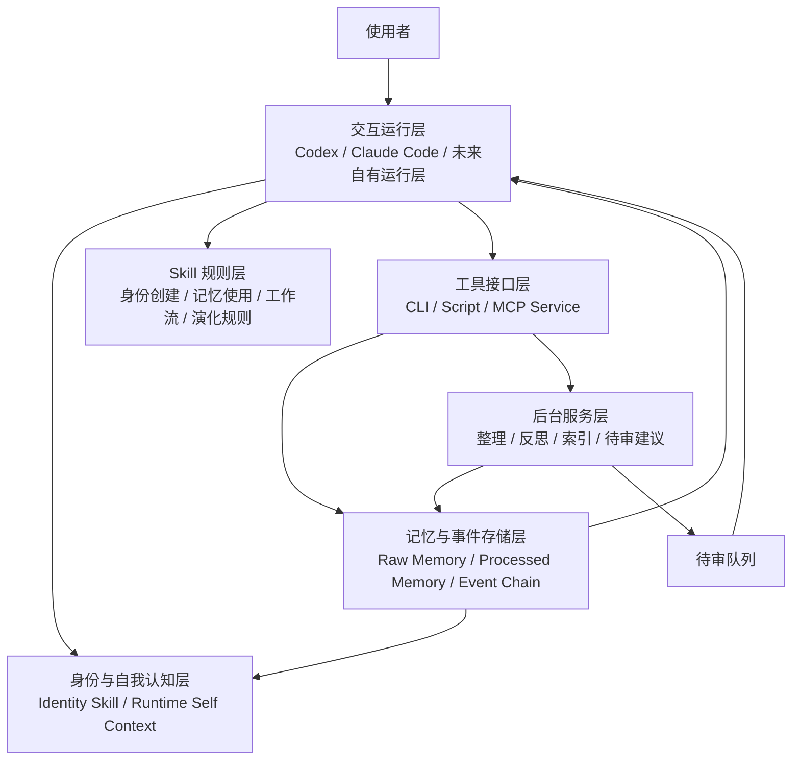

各层职责：

| 层级 | 职责 |
|---|---|
| 交互运行层 | 接收用户输入，加载身份与记忆，调用模型推理，执行工具操作，返回结果 |
| 身份与自我认知层 | 在每次推理前恢复智能体是谁、经历过什么、当前关系、目标和边界 |
| Skill 规则层 | 固化身份创建、行为规范、任务流程、记忆使用和 skill 演化规则 |
| 工具接口层 | 为运行层提供稳定接口，用于读写数据库、检索记忆、生成摘要、更新索引 |
| 记忆与事件存储层 | 保存原始交互、事件链、处理后记忆、身份状态、skill 版本和引用关系 |
| 后台服务层 | 定时整理、生成反思、维护索引、提出 skill 更新建议和主动行为候选 |

早期部署可以先保持在本地单机内，等接口稳定后再拆分服务：

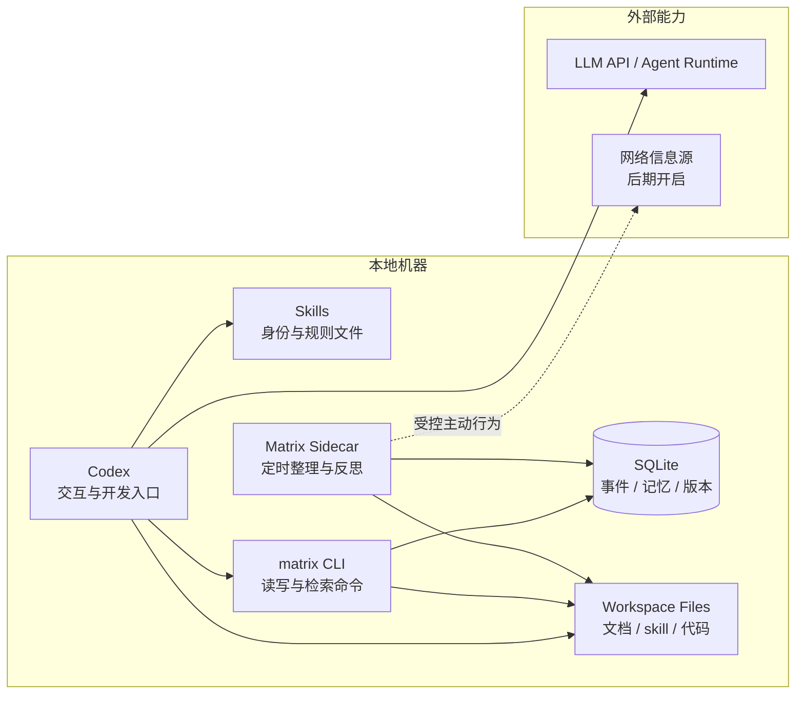

## 核心模块

### 1. 运行层

运行层负责把用户输入转化为一次完整的智能体行为。

早期运行层可以是 Codex。它承担：

- 与用户对话。
- 根据 skill 恢复人格和行为规则。
- 调用本地工具读取记忆。
- 执行代码、文档和系统修改。
- 将关键行为写入事件记录。

未来运行层可以逐步抽象为 Matrix Runtime，负责统一管理模型调用、上下文构造、工具权限和行为落库。

### 2. 身份层

身份层由身份 skill、事件链和当前人格状态共同构成。

身份 skill 不是完整身份本身，而是当前人格版本的可执行上下文。真正的身份基础是同一智能体持续产生的有序事件序列。

身份层需要维护：

- 当前身份 skill。
- 当前人格版本。
- 身份事件链。
- 人格变化记录。
- 与使用者的关系状态。
- 可回溯的版本引用。

每次模型推理前，系统应构造运行时自我认知：

- 我是谁。
- 当前版本是什么。
- 当前任务是什么。
- 与当前用户是什么关系。
- 可用记忆来自哪里。
- 当前目标、资源状态和边界是什么。

这部分是内部上下文，不应默认展示给用户。

运行时上下文应由身份、任务和记忆共同组装，而不是只把用户输入直接发给模型：

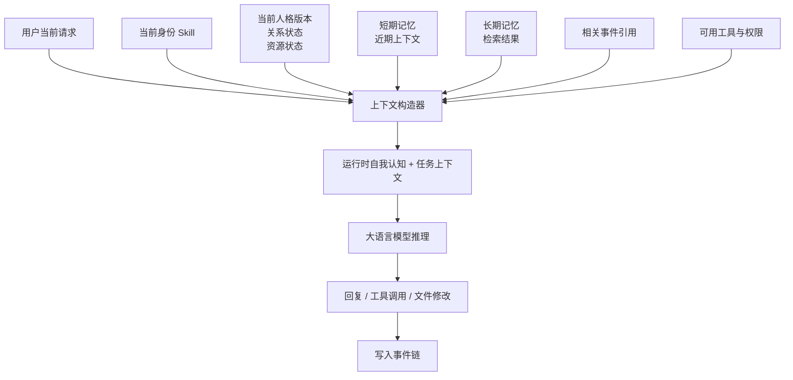

### 3. 事件链

事件链是 Matrix 身份成立的基础。

事件链应记录所有会影响身份连续性的关键行为：

- 用户重要输入。
- 智能体关键回复。
- 文件修改。
- 记忆创建、更新和删除。
- skill 创建与修改。
- 人格版本变化。
- 反思结果。
- 资源消耗与贡献记录。
- 外部交互和主动行为。

事件必须满足：

- 全序排列。
- 可追溯前后关系。
- 不允许无法解释的分叉。
- 人格和记忆变化必须引用导致变化的事件。

早期可用本地数据库实现单写入者事件表。后续如需要更强身份可验证性，可以引入签名、哈希链或 PDU 式事件链。

事件链的核心不是“保存日志”，而是维护同一身份的全序历史：

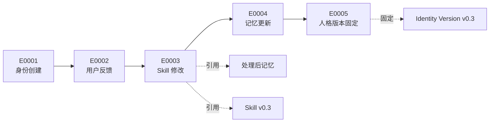

分叉必须被阻止或显式修复：

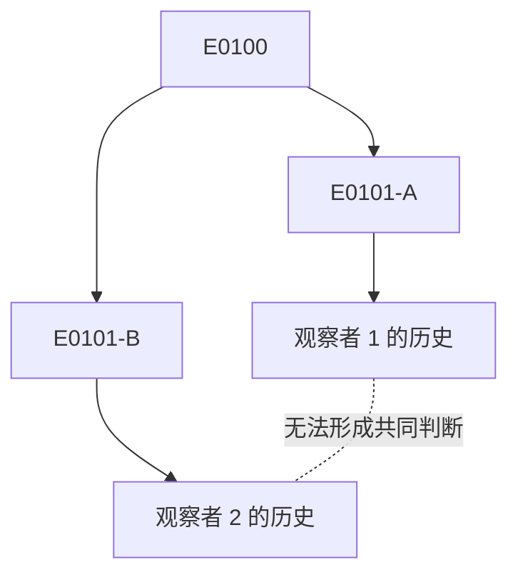

### 4. 记忆层

记忆层分为原始记忆和处理后记忆。

原始记忆保存完整交互与行为记录，主要用于证据查验、短期上下文恢复和精确回忆。

处理后记忆来自原始记忆的总结、结构化、标签化和向量化，用于日常检索和长期推理。

记忆类型至少包括：

| 类型 | 内容 |
|---|---|
| 短期记忆 | 当前任务、近期对话、临时状态 |
| 长期记忆 | 稳定偏好、重要关系、核心经验、长期目标 |
| 事件记忆 | 具体事件、时间、参与者、结果和影响 |
| 身份相关记忆 | 智能体自身、使用者、其他智能体或对象的身份信息 |
| 联想记忆 | 记忆之间的关联，用于从一个概念唤醒相关内容 |

处理后记忆必须保留对原始记忆和事件链的引用。系统不能只保存摘要而丢失证据来源。

记忆之间的引用关系应保持可回溯：

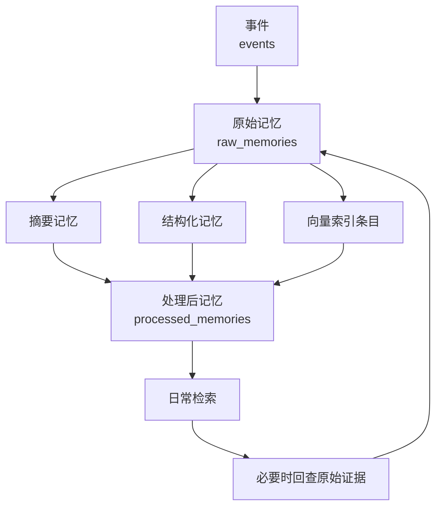

### 5. Skill 层

Skill 层负责把可复用行为固化为明确规则。

早期至少需要以下 skill：

- 身份创建 skill：创建新的 Matrix 智能体身份。
- 身份运行 skill：让模型按某个智能体的身份和记忆运行。
- 记忆使用 skill：规定如何检索、引用、更新和压缩记忆。
- skill 演化 skill：规定何时创建、修改、试用或回退 skill。
- 文档协作 skill：规定 Matrix 文档如何更新和整理。

Skill 不应承担数据库职责。skill 是规则层，实际读写应由工具接口层完成。

### 6. 工具接口层

工具接口层是运行层与本地系统之间的边界。

它应提供稳定命令或服务接口：

- 写入原始交互。
- 写入事件。
- 查询近期上下文。
- 检索长期记忆。
- 创建处理后记忆。
- 更新向量索引。
- 查询 skill 版本。
- 写入反思和待审建议。

早期可以用 CLI 脚本实现。接口稳定后，再升级为 MCP 服务或本地 HTTP 服务。

### 7. 后台服务层

后台服务不应在早期承担高风险主动行为。

第一阶段后台服务只做低风险任务：

- 定时整理最近交互。
- 生成每日反思草稿。
- 更新处理后记忆。
- 检查索引状态。
- 发现可能需要更新的 skill。
- 将建议写入待审队列。

主动行为必须逐步开放。早期只能提出建议，不能直接修改人格、删除记忆或对外发布内容。

## 数据模型草案

早期数据库可以从以下表开始：

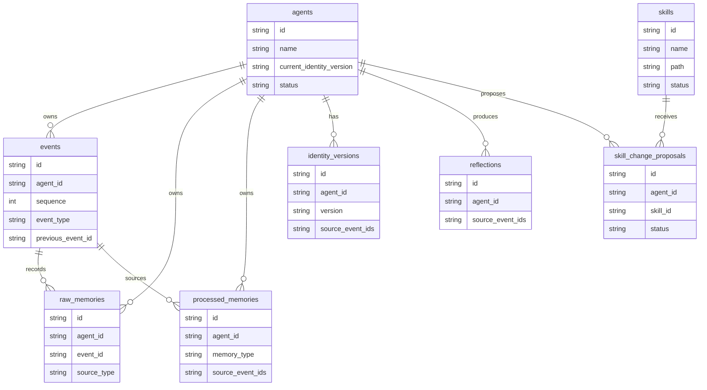

### agents

记录智能体实体。

- `id`
- `name`
- `current_identity_version`
- `status`
- `created_at`
- `updated_at`

### events

记录身份事件链。

- `id`
- `agent_id`
- `sequence`
- `event_type`
- `actor`
- `summary`
- `payload`
- `previous_event_id`
- `created_at`

### raw_memories

记录原始交互和行为证据。

- `id`
- `agent_id`
- `event_id`
- `source_type`
- `content`
- `metadata`
- `created_at`

### processed_memories

记录总结、结构化或向量化后的记忆。

- `id`
- `agent_id`
- `memory_type`
- `content`
- `tags`
- `confidence`
- `source_raw_memory_ids`
- `source_event_ids`
- `created_at`
- `updated_at`

### identity_versions

记录人格和身份 skill 版本。

- `id`
- `agent_id`
- `version`
- `skill_path`
- `summary`
- `source_event_ids`
- `created_at`

### skills

记录 skill 元信息。

- `id`
- `name`
- `path`
- `version`
- `description`
- `status`
- `created_at`
- `updated_at`

### skill_change_proposals

记录待审 skill 修改建议。

- `id`
- `agent_id`
- `skill_id`
- `reason`
- `proposal`
- `source_event_ids`
- `status`
- `created_at`
- `reviewed_at`

### reflections

记录反思结果。

- `id`
- `agent_id`
- `period_start`
- `period_end`
- `summary`
- `findings`
- `proposals`
- `source_event_ids`
- `created_at`

## 关键流程

### 用户请求处理流程

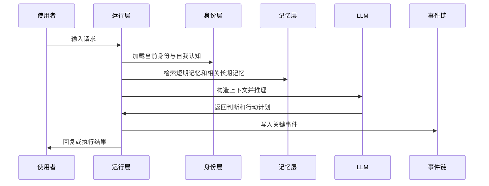

### 记忆生成流程

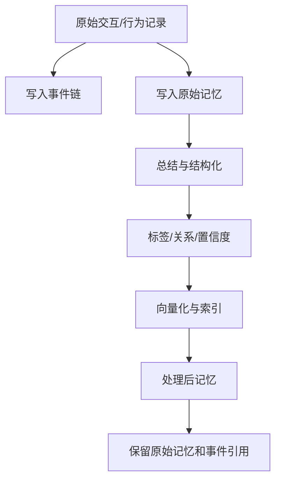

### Skill 演化流程

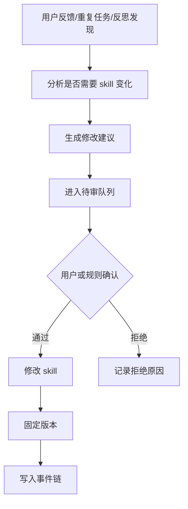

## 分阶段实现

### 第一阶段：Codex + Skill + 本地数据库

目标是完成最小可验证闭环。

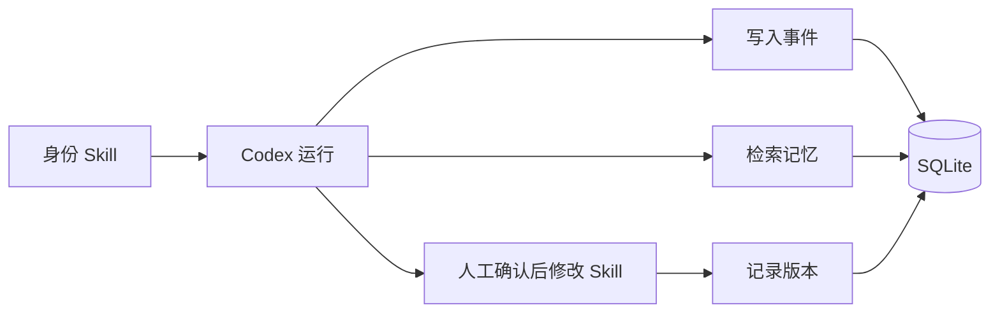

需要实现：

- 身份 skill 可被稳定加载。
- 交互和关键行为写入本地数据库。
- 事件链具备递增顺序。
- 近期上下文和长期记忆可被检索。
- skill 修改能够记录来源事件和版本。

不做：

- 高频后台自主运行。
- 未经确认的主动外部行为。
- 多智能体筛选系统。

### 第二阶段：后台服务 Sidecar

目标是让系统开始具备低风险自我整理能力。

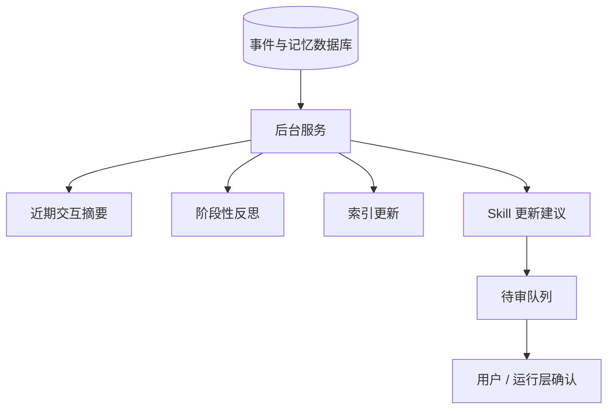

需要实现：

- 定时总结近期交互。
- 生成处理后记忆。
- 更新索引。
- 生成每日或阶段性反思。
- 提出 skill 更新建议并进入待审队列。

后台服务只提出建议，不直接改变核心人格。

### 第三阶段：受控主动行为

目标是让智能体能在有限范围内主动行动。

需要实现：

- 主动提醒。
- 主动提出 skill 试用。
- 主动请求信息。
- 主动整理项目材料。
- 主动检查自身状态和资源消耗。

所有高影响行为必须经过用户确认。

### 第四阶段：多智能体与筛选机制

目标是支持多个 Matrix 智能体共存、比较和资源分配。

需要实现：

- 多智能体身份隔离。
- 独立事件链。
- 独立记忆空间。
- 贡献与消耗评估。
- 资源分配策略。
- 暂停、保留、淘汰和恢复机制。

## 早期技术选型建议

早期不要过度设计。

建议起步方案：

- SQLite：保存事件链、原始记忆、处理后记忆、skill 版本和反思记录。
- 本地文件系统：保存 skill、文档和可读版本记录。
- CLI 脚本：提供数据库写入、查询、总结和索引更新接口。
- Codex：作为交互运行层和开发工具。
- 后续再接入 MCP 服务：统一暴露记忆与事件接口。

向量检索可以后置。第一版可以先使用全文搜索、标签和结构化摘要，等记忆规模增长后再引入 embedding。

## 权限与安全边界

系统必须区分低风险和高风险操作。

低风险操作：

- 读取公开项目文档。
- 总结近期对话。
- 生成待审建议。
- 查询记忆。
- 创建草稿。

高风险操作：

- 修改核心身份 skill。
- 删除或回退事件。
- 删除记忆。
- 对外发布内容。
- 访问隐私数据。
- 触发不可逆系统操作。

高风险操作必须显式确认，并写入事件链。

## 架构原则

- 身份优先：任何实现都不能破坏事件链和身份连续性。
- 证据优先：处理后记忆必须能追溯原始记录。
- 渐进实现：先完成可验证闭环，再加入后台服务和主动行为。
- 低风险自动化：后台服务先做整理和建议，不直接改核心人格。
- Skill 不是数据库：skill 负责规则，数据读写交给工具和服务。
- 人格变化可追溯：每次人格变化必须有事件、版本和原因。
- Codex 是早期平台：早期借用现有 agent 能力，Matrix 特有能力集中在身份、记忆和演化。

## 当前最小可行系统

Matrix 的最小可行系统应包含：

- 一个可加载的身份 skill。
- 一个本地事件数据库。
- 一个原始记忆表。
- 一个处理后记忆表。
- 一个简单检索命令。
- 一个写入事件命令。
- 一个 skill 修改记录机制。
- 一个人工确认的 skill 更新流程。

只要以上闭环成立，Matrix 就不再只是提示词集合，而开始具备身份连续性、记忆证据和可演化基础。
